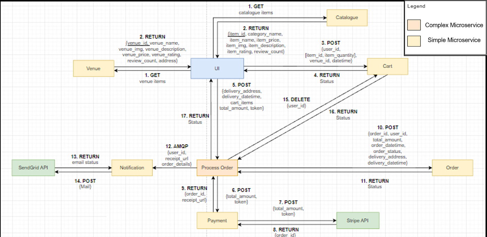
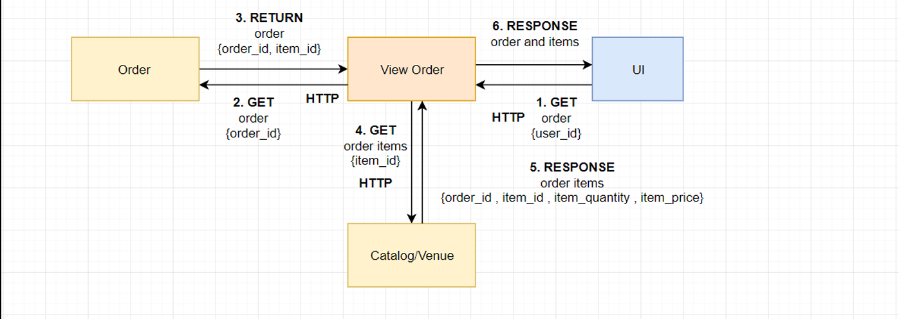
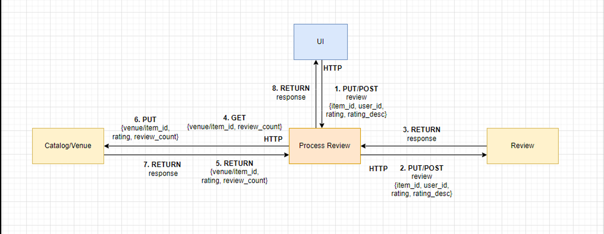
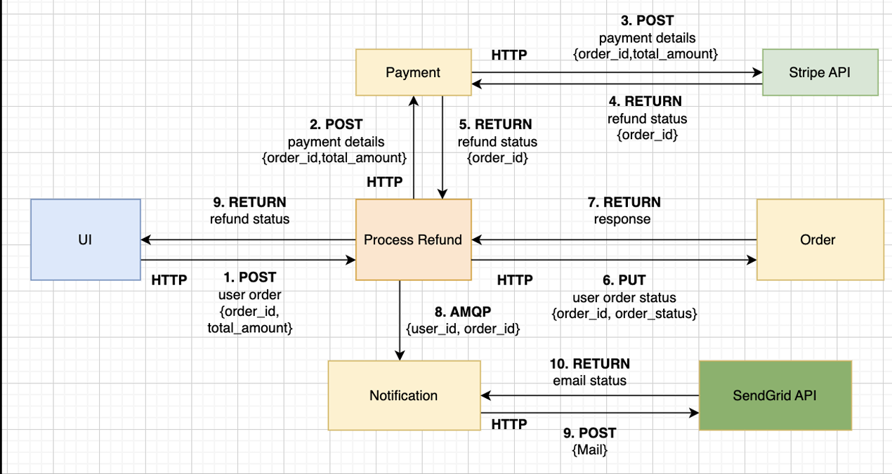
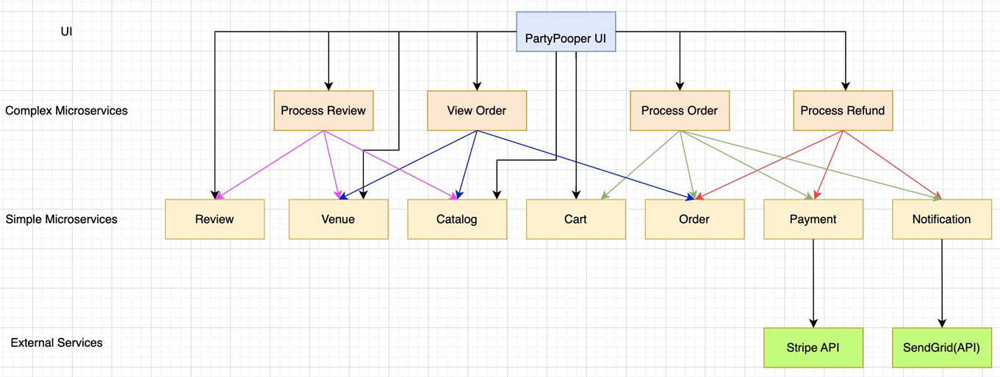

# Party Planning Market

Party Planning Market is an event-booking platform that allows users to browse party items and venues, add selections to a cart, place orders, view order details and status, cancel orders, request refunds, and submit reviews.

The platform uses Python/Flask microservices to manage the catalogue, venues, carts, orders, reviews, and payments. Complex services coordinate the order, refund, review, and order-view workflows. RabbitMQ carries order and refund notifications to a Node.js service, which sends emails through SendGrid, while Stripe handles payments and refunds. Docker Compose supports running the services locally.

## Tech Stack

Python / Flask, Node.js, SQLAlchemy, SQLite, RabbitMQ, Docker Compose, Stripe, SendGrid and Google Maps

## Project Structure

- `main/` — Flask web application
- `microservices/simple/` — catalogue, venue, cart, order, review, payment and notification services
- `microservices/complex/` — order, refund, review and order-view workflows
- `databases/` — SQL database schemas

## Main Flows

### Placing an order

Users select catalogue items or a venue, add them to the cart, and proceed to checkout. The order-processing service coordinates payment through Stripe, stores the order, clears the cart, and sends a notification through RabbitMQ.



### Viewing an order

Users can view their previous orders and retrieve the associated item and venue details through the View Order service.



### Submitting a review

Users can add or edit a review for an item or venue. The review workflow updates the corresponding catalogue or venue rating after the review is processed.



### Cancelling an order

Users can request a refund from the order history page. The refund workflow sends the payment details to Stripe, updates the order status, and sends a notification through RabbitMQ and SendGrid.



## Architecture

```text
Flask web application
        |
        +--> Simple domain microservices --> SQL databases
        |
        +--> Complex workflow services --> Simple domain microservices

Order and refund events --> RabbitMQ --> Notification service --> SendGrid
Payment and refund requests --> Stripe
```



## Running Locally

Copy `.env.example` to `.env` and provide local test credentials before starting the services:

```bash
docker compose up --build
```

To run the web application separately:

```bash
cd main
pip install -r requirements.txt
python app.py
```

The payment and notification services require valid test credentials. Do not commit `.env` or credential files.

## API Overview

Backend service endpoints use the `/api/v1` prefix, including:

- `/api/v1/catalogue` for catalogue items
- `/api/v1/venue` for venues
- `/api/v1/create_order` for order processing
- `/api/v1/refund` for refunds
